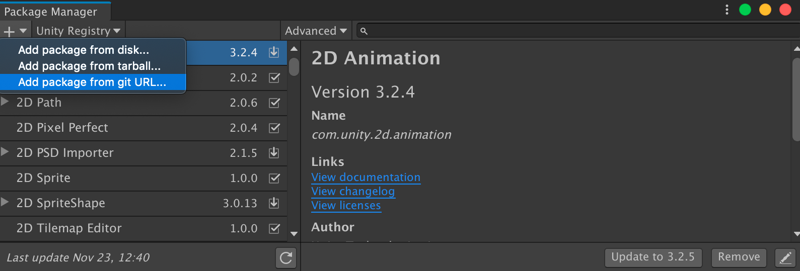
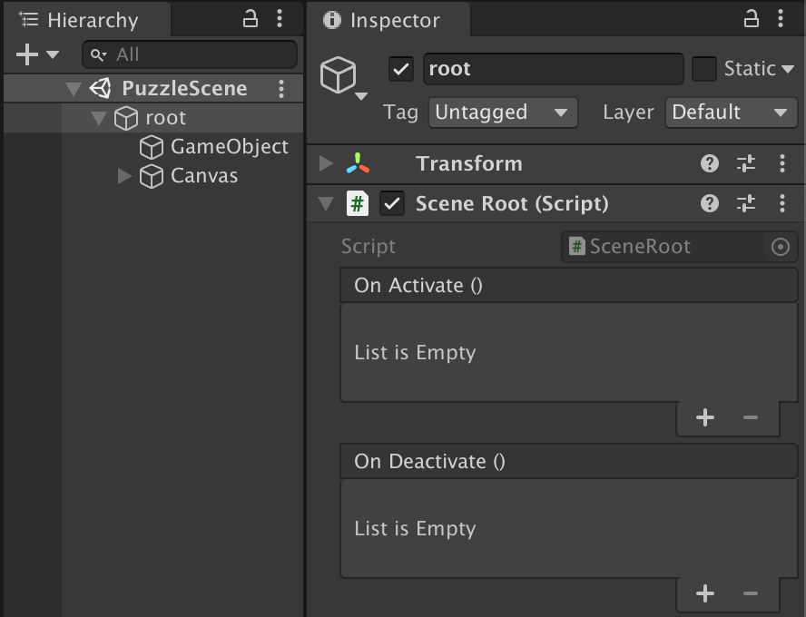

# Unity Scene Handling

## Reasoning

The default behavior for loading scenes in the Unity game engine is to unload all currently loaded scenes and load the requested scene synchronously. This behavior may lead to dips in frame rate and game interactivity, having scenes that are larger than necessary, having to duplicate functionality across scenes and other issues.

This package contains a static utility class that provides extra functionality for the loading and unloading of scenes. It is designed to provide asynchronous, additive by default scene loading, the capability to safely load the same scene multiple times, the capability to insert dependencies in the loaded scene and allow for explicit control over when scenes are loaded or unloaded.

## Installation

Add this package to your Unity project using the "Add package from git URL..." option inside the package manager.

Or download a copy and extract it inside your project's Assets folder.

## Usage

Add a *SceneRoot* component to a *GameObject* in the root of your scene hierarchy.


Add the namespace.
```cs
using VV.SceneHandling;
```

In this example, a scene is loaded by using the *SceneHandler.Load* method and passing in the scene name and an object containing puzzle data as parameters.

The method returns an *SceneLoadHandle* object that encapsulates some of the *UnityEngine.AsyncOperation* class functionality and allows the class responsible for loading the puzzle to keep a reference of it. *SceneLoadHandle.IsDone* will be true after the scene finishes loading.
```cs
public class GameManager : MonoBehaviour
{
    IEnumerator Start()
    {
        var puzzle = levels[current];
        SceneLoadHandle handle = SceneHandler.Load("PuzzleScene", puzzle);
        yield return new WaitUntil(() => handle.IsDone);
        [...]
```

The *SceneRoot* object at the root of the newly loaded scene hierarchy can access the injected object through the *SceneRoot.Payload* property.
```
public class PuzzleScene : SceneRoot
{
    public bool Finished { get; private set; } = false;

    IEnumerator Start()
    {
        var puzzleData = (PuzzleData)Payload;
        InstantiatePuzzle(puzzleData);
    }
    [...]
}
```

After the puzzle is finished, the handle can be used to explicitly unload the puzzle scene using the *SceneHandler.Unload* method.
```cs
public class GameManager : MonoBehaviour
{
    IEnumerator Start()
    {
        [...]
        PuzzleScene sceneRoot = (PuzzleScene)handle.Root;
        yield return new WaitUntil(() => sceneRoot.Finished);
        SceneHandler.Unload(handle);
    }
}
```
